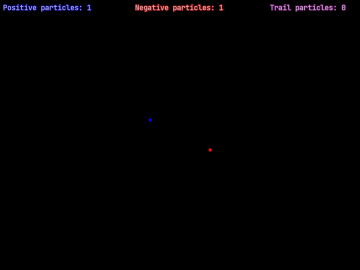

# ChargedParticles
Interactive simulation involving positive and negative charged particles.

All action is the result of the mutual Coulomb Force between all particles present at any given time.

# Demo

# Simulation Controls
- `Left-Click` - Spawn positive charge at cursor
- `Right-Click` - Spawn negative charge at cursor
- `Ctrl-Left-Click` - Continuously spawn positive charges at cursor
- `Ctrl-Right-Click` - Continuously spawn negative charges at cursor
- `Space` - Play simulation
- `Escape` - Pause simulation
- `Up-Arrow` - Increase simulation speed
- `Down-Arrow` - Decrease simulation speed
- `p` - Toggle particle visibility
- `t` - Toggle particle trail visibility
- `l` - Toggle location vector visibility
- `c` - Toggle particle count text visibility
- `s` - Toggle simulation speed text visibility
- `e` - Toggle potential energy & kinetic energy text visibility
